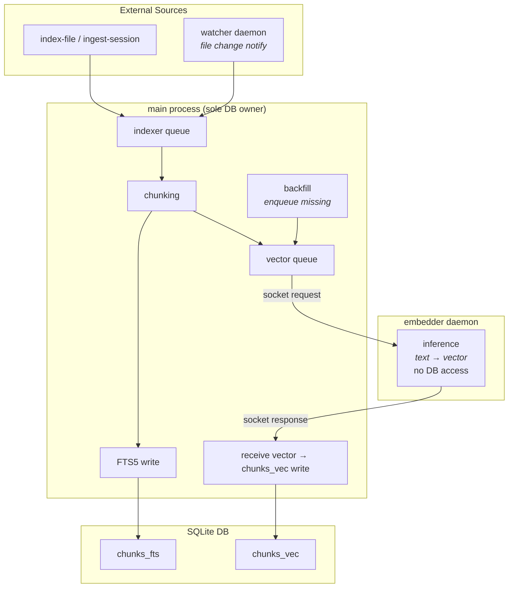
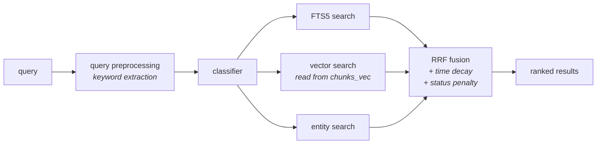

# The Space Memory

A cross-workspace knowledge search engine built in Rust.

Indexes Markdown documents across multiple workspaces and provides hybrid search
combining FTS5 full-text search with vector semantic search (ruri-v3-30m, 256-dim).

## Features

- **Hybrid search** — FTS5 + vector search fused via Reciprocal Rank Fusion (RRF)
- **Morphological analysis** — Japanese tokenization via lindera (IPADIC)
- **Semantic search** — ruri-v3-30m embeddings computed locally with candle (no ONNX Runtime)
- **Entity graph** — Automatic entity extraction and link inference
- **Synonym expansion** — WordNet-based query expansion
- **Session ingestion** — Index Claude Code session transcripts as searchable knowledge
- **Single binary** — No Python, no external runtime dependencies

## Usage

```bash
# Search
tsm search -q "query" -k 5

# Index all documents
tsm index

# Start embedder daemon (required for vector search)
tsm embedder-start

# Health check
tsm doctor

# Rebuild database
tsm rebuild --force
```

## Architecture

### Data Flow



### Component Responsibilities

```mermaid
graph LR
    subgraph Main["main process"]
        direction TB
        M1["DB ownership<br/>All reads & writes"]
        M2["Indexer queue"]
        M3["Vector queue"]
        M4["Backfill coordination"]
    end

    subgraph Embedder["embedder daemon"]
        direction TB
        E1["Model inference only"]
        E2["Stateless"]
        E3["No DB access"]
    end

    subgraph Watcher["watcher daemon"]
        direction TB
        W1["File system monitoring"]
        W2["inotify / FSEvents"]
        W3["Stateless"]
        W4["No DB access"]
    end

    Watcher -->|"file path"| Main
    Main -->|"text"| Embedder
    Embedder -->|"vector"| Main
```



### Search Flow



## License

[MIT](LICENSE)
